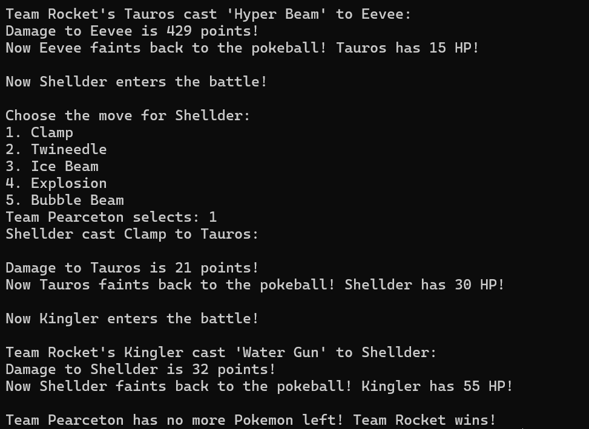

# Pokemon Colosseum
Pokemon Colosseum is a turn-based Pokemon battle simulator where you (the player) face off against Team Rocket.
Each side is assigned 3 random Pokemon, and each Pokémon has random moves assigned from its move list.
The game continues until one team runs out of Pokémon.

## Requirements
  - Python 3.11
  - An IDE for Python to run

## Steps to Run
  1. Download zip file
  2. Navigate to folder holding PokemonColloseum.py, and open terminal / command prompt
  3. Run the program
     ```bash
     python PokemonColosseum.py
     ```
## Gameplay Instructions
  1. When prompted, enter your name.
  2. Your team and Team Rocket will be assigned 3 random Pokemon from the Indigo League.
  3. A coin flip will determine who goes first.
  4. When it is your turn, enter the number corresponding with the move you would like your Pokemon to perform.
  5. The battle continues until one team has no Pokemon left.

## Preview
### Beginning of Battle


### End of Battle

